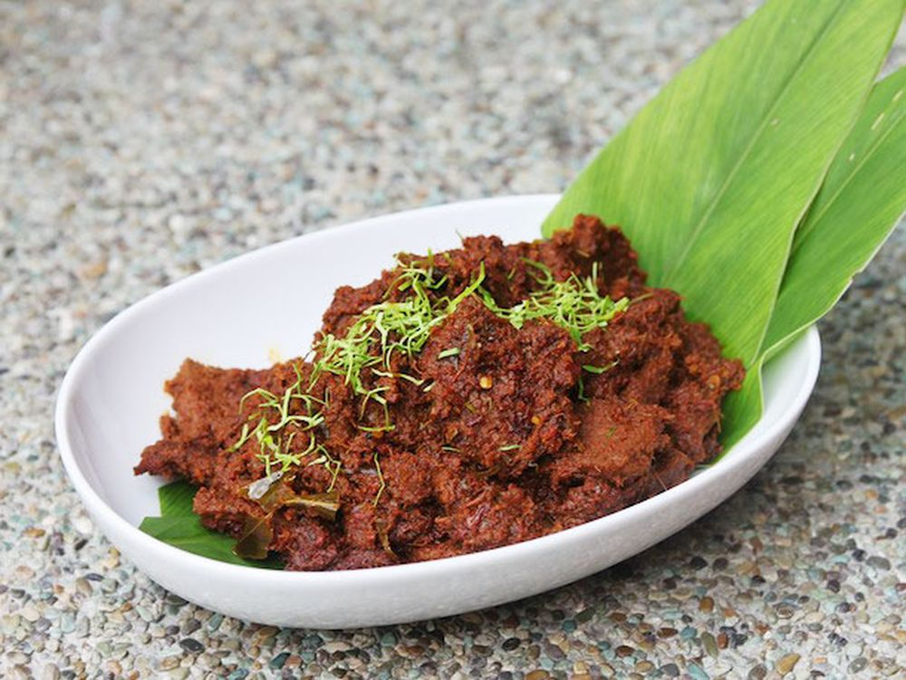

# Top 10 Indonesian Cuisine

Indonesia is famous with its variety cuisine. Some of this cuisine represents the unique culture of its original region. Interestingly, some of this cuisine are usually consume only for a specific periods of time or during cultural event.

**1. Beef Rendang**

[About](/about)
